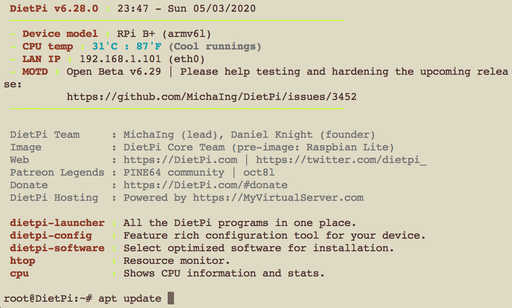
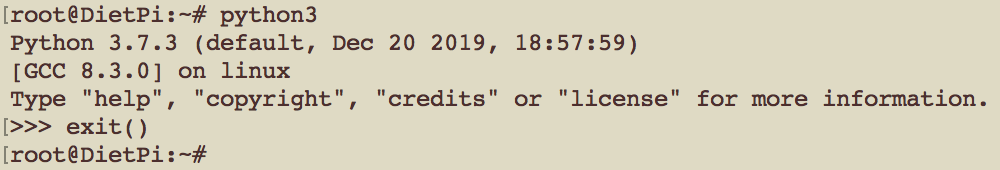
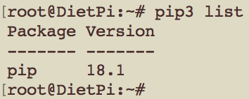
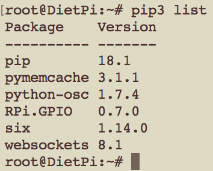
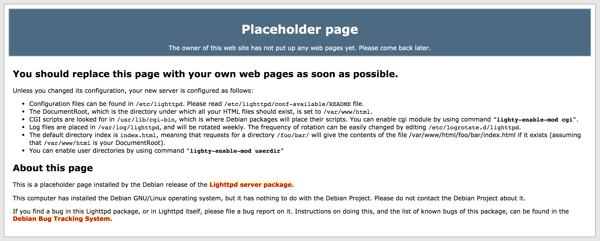
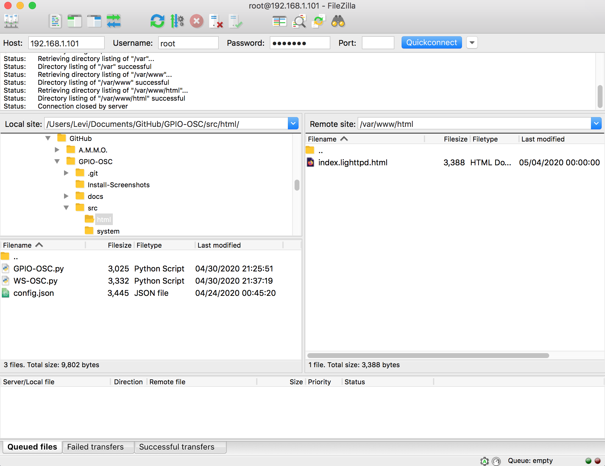
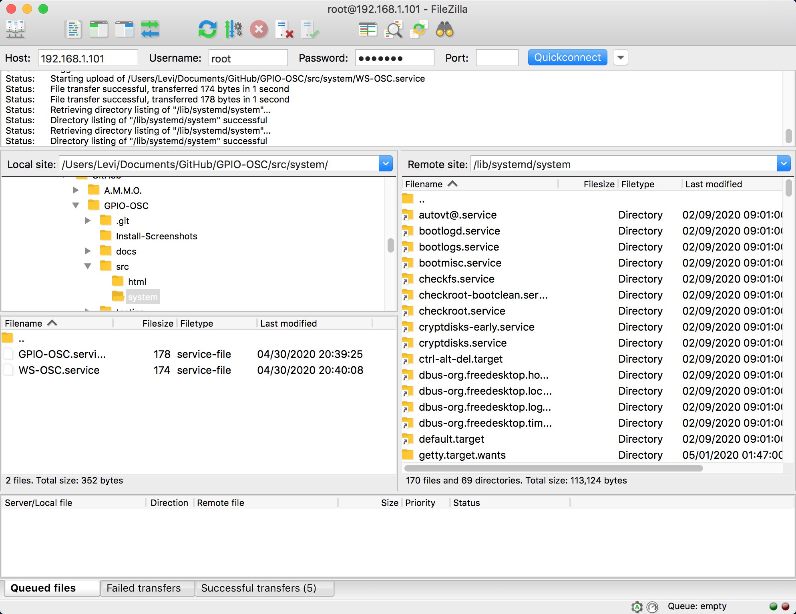
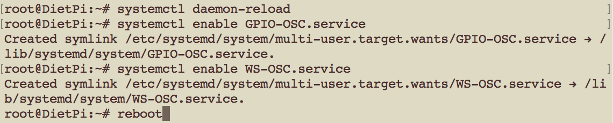
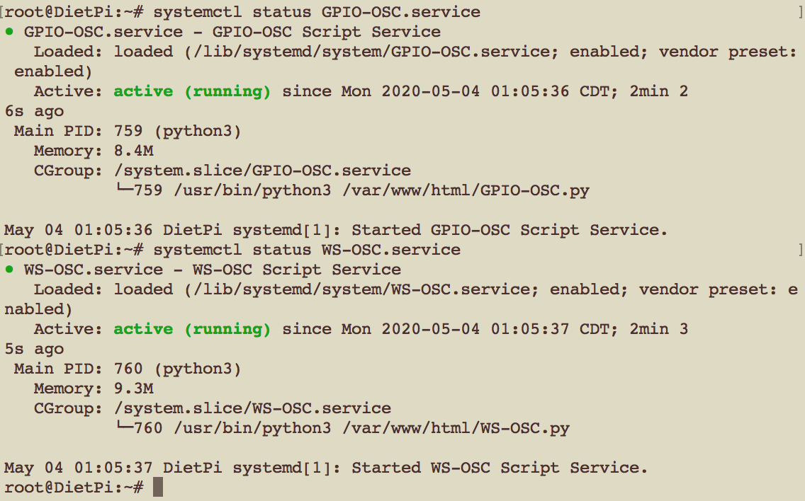

 # OSC Installation

 #### A Note On This Guide:
 This guide uses some emoji and symbols to convey different actions the user should take or items the user may see.
 - The :arrow_up:, :arrow_down:, :arrow_left:, and :arrow_right: emoji symbolize the arrow keys on the user keyboard. Items that appear in `code` with < > around them are also keyboard keys. Example `<enter>` means your keyboard Enter or Return Key.
 - Items in `code` without < > are literal strings that the user should type. Example: `sudo reboot` is a linux command to restart the pi. To do this the user types the string into the terminal and hits the enter key.
 - Lastly, items in " " are strings that appear somewhere on the screen. Commonly these are items in a list of menu that need to be selected. For example the phrase \- *hit `<enter>` on the "\<Cancel>" option* \- is asking the user to find the Cancel option on the screen, select it and hit the Enter key on their keyboard.

 #### Things You Will Need
 - Complete [Setting_Up_The_Pi.md](Setting_Up_The_Pi.md)
 - An Internet Connection
   - USB Wifi Adapter for older Pis (if using WiFi for internet)
   - Cat5e or Cat6 cable (if using wired internet)
 - Recommended: A separate PC with internet
   - Recommended: FTP Client
     - Multiplatform: [Filezilla](https://filezilla-project.org/)
     - Mac OS: [Transmit](https://panic.com/transmit/)
     - Windows: [WinSCP](https://winscp.net/eng/index.php)
   - Optional: SSH Client
     - Mac / Linux: Built into Terminal
     - Windows: [PuTTY](https://www.chiark.greenend.org.uk/~sgtatham/putty/)

 #### Instructions
 1. Login into the Pi with the `Root` user. This can be done directly on the Pi or via SSH.
 2. To start, we will install some software using the default package manager `APT`. Update your software database with `apt update`. 
   - Install our light weight web server Lighttpd with `apt install lighttpd`. When prompted for confirmation hit `y` then `<enter>`.
   - Install Memcached with `apt install memcached`.
   - Install the Python package manager Pip with `apt install python3-pip`.
 3. Now we need to verify our python and pip versions.
   - To check python enter the python shell with `python3` this should give you a python prompt like `>>>`. Above the prompt will be the version info. We need version 3.7.0 or newer.
   - Leave the python shell with the command `exit()`. 
   - To check our pip version run the command `pip3 list`. We want version 18.0 or newer. 
 4. Now we will install some python packages.
   - Install Pymemcache with `pip3 install pymemcache`.
   - Install RPi.GPIO with `pip3 install RPi.GPIO`.
   - Install Python-OSC with `pip3 install python-osc`.
   - Install websockets with `pip3 install websockets`.
 5. Verify these installs with `pip3 list`. 
 6. Now lets reboot the Pi with `reboot`. Reconnect / Login to the Pi as `root` after the reboot is complete.
 7. Check to see that the webserver is running. On your pc, open your favorite web browser and go to the ip address of the Pi. You should see a default placeholder page. 
 8. Next we will install our project files. Download the `src` directory of the Github repo to your PC and connect your FTP client to the Pi as the user `root`.
   - If you do not have a pc available, you can use `git` to download the repo and `mv` to move files to their correct directories. This will also require file permissions to be adjusted.
 9. In your FTP client, open the server folder `/var/www/html/`.
  - Copy the contents of `src/html/` to the server. **DO NOT COPY / OVERWRITE THE HTML FOLDER - COPY ONLY IT'S CONTENTS!** 
  - Next, open the server directory `/lib/systemd/system/`.
  - Copy the contents of `src/system/` to the server. **DO NOT COPY / OVERWRITE THE SYSTEM FOLDER - COPY ONLY IT'S CONTENTS!** 
 10. Next we will set the Python scripts to run on boot.
  - Reload the systemd cache with `systemctl daemon-reload`.
  - Enable GPIO-OSC.service with `systemctl enable GPIO-OSC.service`.
  - Enable WS-OSC.service with `systemctl enable WS-OSC.service`.
  - Reboot the Pi with `reboot`. 
 11. Login to the Pi as `root` and verify the scripts are running.
   - `systemctl status GPIO-OSC.service`.
   - `systemctl status WS-OSC.service`. 
 12. If everything is working, shutdown the pi with `poweroff`, then wire the pi up. Power up the Pi when ready, the scripts and webserver should work without needing to login. Boot time may take a couple minutes.

Congrats :tada: the Pi is now setup for OSC control via GPIO and the Web!
