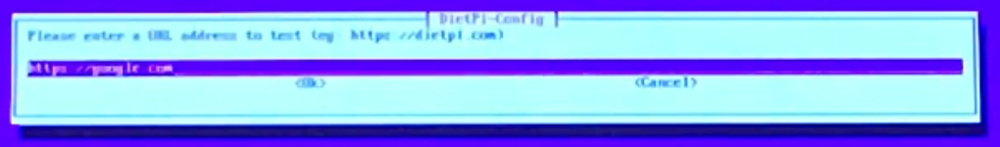
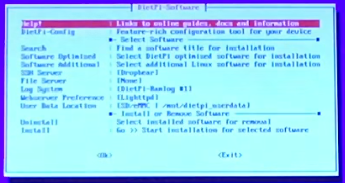

 # Setting Up The Raspberry Pi

 #### A Note On This Guide:
 This guide uses some emoji and symbols to convey different actions the user should take or items the user may see.
 - The :arrow_up:, :arrow_down:, :arrow_left:, and :arrow_right: emoji symbolize the arrow keys on the user keyboard. Items that appear in `code` with < > around them are also keyboard keys. Example `<enter>` means your keyboard Enter or Return Key.
 - Items in `code` without < > are literal strings that the user should type. Example: `sudo reboot` is a linux command to restart the pi. To do this the user types the string into the terminal and hits the enter key.
 - Lastly, items in " " are strings that appear somewhere on the screen. Commonly these are items in a list of menu that need to be selected. For example the phrase \- *hit `<enter>` on the "\<Cancel>" option* \- is asking the user to find the Cancel option on the screen, select it and hit the Enter key on their keyboard.

 #### Things You Will Need
 - A Raspberry Pi (duh)
 - 5v USB Power Adapter
 - 2GB or Larger Micro SD Card
 - An Internet Connection
   - USB Wifi Adapter for older Pis (if using WiFi for internet)
   - Cat5e or Cat6 cable (if using wired internet)
 - For Initial Setup Only:
   - An HDMI Monitor, HDMI Cable, and USB Keyboard
 - A separate PC to flash the SD Card
   - Connected to the Internet
   - SC Card Reader w/ Micro SD Card adapter if necessary

 #### Instructions
 1. Download the latest version of DietPi from [https://dietpi.com/#download](https://dietpi.com/#download)
 2. Flash your SD Card with the .img file
  - Multi-platform: [Etcher](https://www.balena.io/etcher/)
  - Windows: [Win32DiskImager](https://sourceforge.net/projects/win32diskimager/)
  - [Additional Documentation / Installer Options](https://www.raspberrypi.org/documentation/installation/installing-images/README.md)
 3. Insert the SD Card to the Pi and connect the monitor, keyboard and network adapter or cable. Then plug in the power.
 4. Make Some Tea - The Pi will run the install scripts, this will take some time and the Pi will reboot itself a few times.
 5. Eventually, the Pi will prompt you with "Please hit \<return> to login", hit your `<enter>` key on the keyboard. 
 6. Login using the listed credentials, username: `root` password: `dietpi`
 7. You will be prompted to accept the EULA, hit `<enter>` to accept.
 8. Next, the Pi will attempt to connect to the internet.
  - If your internet connection is preconfigured (for example: wired ethernet with DHCP) skip to step 17.
  - If the Pi cannot reach the internet, you will be prompted with the following error. Hit `<tab>` to get to the option list then hit :arrow_down: to highlight "dietpi-config" then hit `<enter>`. 
 9. Hit :arrow_down: to select option 7 "Network Options: Adapters" and hit `<enter>` 
 10. Hit the :arrow_down: once to select "IPV6 [ON]" and hit `<enter>`. This will disable IPV6 which (if enabled) will cause issues in our project. 
 11. Now use the :arrow_up: to select the network interface you want to configure and hit `<enter>`. For Ethernet continue to step 12; for WiFi jump to step 13. 
 12. For an Ethernet Config, the adapter is enabled with DHCP by default. So likelihood is, if you are at this step, we need to set a static IP address. If not, you need to troubleshoot your ethernet connection separately.
   - For a static IP, press :arrow_up: to select "Change Mode [DHCP]" and hit `<enter>`. This will toggle to static mode. 
   - Now hit :arrow_down: to select "Static ip : [0.0.0.0]" and hit `<enter>`. 
   - You will now be prompted to enter a new ip address. Type the ip address and hit `<enter>` when done. 
   - Repeat the above steps for your subnet mask, default gateway, and DNS address as necessary. Once all your information is inserted, press :arrow_down: to select "Apply" then hit `<enter>`. 
   - You will be prompted for confirmation, hit :arrow_left: `<enter>`. Your settings will then apply, this will take a bit of time. 
   - After the settings are applied, it will bring you back to the ethernet menu. Hit `<tab>` then :arrow_right: then `<enter>` to select "\<Back>" and return to the networking menu. Ethernet is now configured, jump to step 14 to test your internet connection.
 13. WiFi comes disabled by default, so before we can configure the WiFi, we need to enable it. When prompted, press :arrow_left: then `<enter>` to select "\<OK>" to enable the WiFi adapter. 
   - WiFi will now show a status of being "ON". Hit :arrow_up: to select "WiFi" again and hit `<enter>`.
   - Now we need to set our country code. The default is "GB" (Europe / Great Britain). If that is your region, skip this step. Otherwise, hit :arrow_up: to select "Country : [GB]" and hit `<enter>`. 
   - Using the :arrow_up: and :arrow_down: keys, select your region and hit `<enter>`. If your region isn't listed, select "Manual" then type in your region code. 
   - Next hit :arrow_up: to select "Scan" and hit `<enter>`. You will then be prompted to select a WiFi Slot, hit `<enter>` to select slot 0. 
   - Here you can Scan for an SSID or enter your information manually. I am going to do a scan. If your SSID is hidden or requires extra configuration, chose manual and enter your information as prompted. To continue with the scan hit `<enter>`. 
   - Using the :arrow_up: and :arrow_down: keys, select your network from the list and hit `<enter>`. 
   - Using the :arrow_up: and :arrow_down: keys, select your security type from the list and hit `<enter>`. 
   - Enter your credentials as necessary and then hit `<enter>`. 
   - You will then be brought back to the slot selection menu. Hit `<tab>` then :arrow_right: to select "\<Done>" then hit `<enter>`. 
   - Now hit :arrow_down: to select "Apply" and hit `<enter>`. You will be prompted for confirmation, hit :arrow_left: `<enter>` and your WiFi settings will be applied. This will take some time. 
   - After the settings are applied, it will bring you back to the WiFi menu. Hit `<tab>` then :arrow_right: then `<enter>` to select "\<Back>" and return to the networking menu. WiFi is now configured, continue to step 14 to test your internet connection.
 14. With our network configured, lets run an internet test. In the networking menu, hit :arrow_down: to select "Test", then hit `<enter>`. 
   - We are going to run a combo test to make sure our internet and DNS are working. Hit `<enter>` on the URL screen to start the test. 
   - If the test succeeds, the status on the Networking Menu Page will say "[Success | Online]". If it fails, it will issue an error page. The first thing to try is to run the test again, but use `8.8.8.8` instead of `https://google.com` to see if the issue is internet or DNS related. 
   - With the Pi Online, Our networking config is done. Hit `<tab>` then :arrow_right: then `<enter>` to select "\<Back>" and return to the DietPi-Config main menu.
 15. Now that our network in configured, we need to exit "DietPi-Config" and reboot our Pi. To do that, from the dietpi-config main menu, hit `<tab>` then :arrow_right: to select "\<Exit>" then hit `<enter>`. 
   - You will be prompted for confirmation. Hit :arrow_left: for "\<OK>" then `<enter>`. 
   - Next you will be prompted to reboot. Hit :arrow_left: for "\<OK>" then `<enter>`. 
 16. After the reboot, you will need to login. Hit `<enter>` for the login prompt and enter the username: `root` and the password: `dietpi`. 
   - Once logged in, you will be prompted to update your passwords. It will first ask about the global software account then the "root" and "dietpi" user accounts. For a production server you should change these passwords, but for this example I am going to just hit `<enter>` on the "\<Cancel>" option to keep the default `dietpi`.  
   - Next you will be asked if you want to keep the serial console active. I recommend doing so and so I hit `<enter>` on the "\<Cancel>" option. 
 17. With our Pi connected to the internet, the installation scripts will automatically run a program called "Deitpi-Software". Using this program we can install additional software that has beed specially optimized to work with DietPi. 
   - In our case, we only need to add 1 external program. Hit :arrow_down: to select "Software Optimized" and hit `<enter>`.
   - This will give us a list of available software to install. Use the :arrow_up: and :arrow_down: keys to find "ProFTP" number 94 (toward the bottom of the list). With it highlighted, hit `<spacebar>` to select it with an \* between it's brackets. [ ] becomes [ \* ].  
   - Next hit `<tab>` to select "\<OK>" and hit `<enter>`.
   - Now we need to set "ProFTP" as our default file-sharing application. Hit :arrow_down: to select "File Server" then hit `<enter>`.
   - Use :arrow_up: and :arrow_down: to select "ProFTP" from the list then hit `<enter>`. 
   - Hit `<enter>` to confim your selection. 
   - Now we are ready to install. Use :arrow_down: to select "Install" and hit `<enter>`. At the confirmation prompt, hit :arrow_left: to select "\<OK>" then hit `<enter>`. 
   - This is going to take a *LONG* time. DietPi will now install a myriad of updates, supplemental packages, and our software selection. Software installation is usually a speedy process but because this is the initial run-through there is a lot of extra work to be done.
   - Once all the software is installed, DietPi will ask you if you want to take part in their usage survey. I hit `<enter>` on the default "0: Opt Out" option. 
   - Finally, we are told that installation is complete! A reboot is required at the end of this process. Hit `<enter>` to reboot. 
 18. After rebooting, you will be prompted to login. Hit `<enter>` for the login prompt. If you have not yet been asked to change your password, login using the username: `root` and the password: `dietpi`. If you have changed your password you should still use `root` as the username but use your own password instead.
   - You may be prompted to change your password if it is still the default and you have not yet been asked to change it. If so, check out Step 16 for more information, then return here to continue.

 
 19. Next we need to set our localization options. At the terminal prompt enter `dietpi-config` to launch the config tool. 
  - Using :arrow_up: and :arrow_down: select option 5 "Language / Regional Options" 
  - Hit `<enter>` on the "Locale : [en_GB.UTF-8]" option. 
  - This is the Locale and Dictionary option. The default is *British English* being that I am in the United States I want *American English*. To do this, use :arrow_up: and :arrow_down: to highlight "en_US.UTF-8" then hit `<enter>`. 
  - This will take some time to update all the databases with the new language pack. Once done, it will send you back to the "Language / Regional Options" menu.
  - Now use :arrow_down: to select "Timezone" and hit `<enter>`.
  - You will be prompted with a list of primary regions. Use :arrow_up: and :arrow_down: to select the appropriate one. In my case I want "US". Then hit `<enter>`. 
  - Next use :arrow_up: and :arrow_down: to select the correct timezone region then hit `<enter>`. I am using "Central" because I am near Chicago. You should use the one that suits you best. Note: Arizona has it's own timezone region. 
  - Finally, hit :arrow_down: to select "Keyboard" and hit `<enter>`. Until now, our keyboard selection shouldn't have really mattered; but, for the sake of completeness, we should change it to match our actual keyboard layout.
  - Hit `<enter>` to confirm there is an attached keyboard. 
  - If you know your **EXACT** keyboard driver profile you can use that. I have found that the default "Generic 105-key PC (Intl.)" works very well for my needs without much fuss. Select the profile you want to use with :arrow_up: and :arrow_down: then hit `<enter>` on it. 
  - Now we select our keyboard layout. British layouts are the default, use the :arrow_down: to select "Other" then hit `<enter>`. 
  - Use :arrow_down: to select "English (US)" then hit `<enter>`. 
  - Now use :arrow_up: to select "English (US)" then hit `<enter>`. 
  - Hit `<enter>` to select "The default for the keyboard layout" for the "AltGr" Key question. 
  - Hit `<enter>` to select "No compose key" for the Compose Key question. 
  - Localizations are now set. Hit `<tab>` :arrow_right: to select "\<Back>" then hit `<enter>`.
  - Finally, hit `<tab>` :arrow_right: to select "\<Exit>" then hit `<enter>`. Hit :arrow_left: to select "\<OK>" on the confirmation then `<enter>`.
 20. If prompted to reboot on exiting DietPi-Config, hit :arrow_left: to select "\<OK>" then hit `<enter>`. If not prompted to reboot use the command `reboot` from the terminal to start a reboot.
   - After rebooting, login as `root`.
 21. We have one config left to change. ProFTP needs to have it's default directory and user permissions updated.
   - We are going to use the text editor "Nano" to change the config.
   - Use the command `nano /etc/proftpd/proftpd.conf`.
   - Use the arrow keys to navigate the document. Find the line near the bottom `DefaultRoot    /mnt/dietpi_userdata` and change it to `DefaultRoot     /`. A few lines further down is `RootLogin    off` and change it to `RootLogin    on`. 
   - Save by hitting `<control> + <x>` then hit `<y>` then `<enter>`. 
   - Back in the terminal enter `systemctl restart proftpd`.

Congrats :tada: the initial config of a headless Raspberry Pi running DietPi is complete. You should now be able to FTP and SSH into your pi as the root user. At this point, you should no longer need a keyboard or monitor attached to the pi. Simply power the pi up, wait a minute or two, and connect with your favorite SSH and/or FTP client.

:star:To safely shutdown your pi, use the command `poweroff`.
